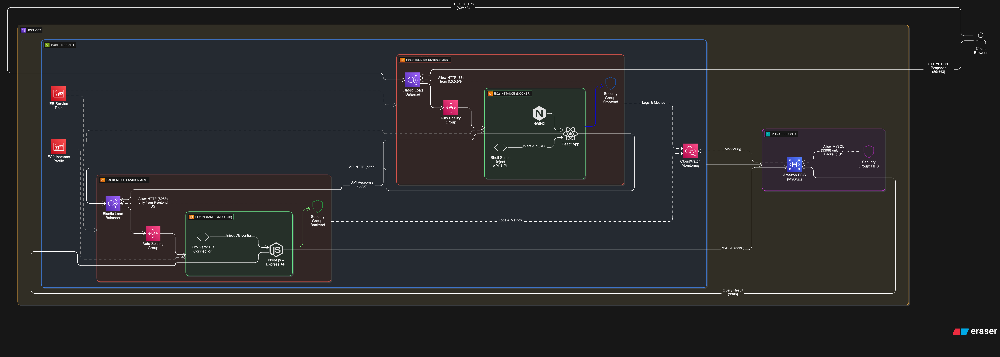

# 🏗 AWS 3‑Tier Application Deployment (React + Node.js + MySQL + Amazon RDS + AWS Elastic Beanstalk)


---
## 📌 Overview

This project is a **full-stack 3‑tier web application** deployed on **AWS**, featuring:

- **Frontend**: React application, served via **NGINX** inside a **Docker** container
- **Backend**: Node.js + Express REST API, providing authentication and CRUD functionality
- **Database**: MySQL hosted on **Amazon RDS**
- **Deployment**: Managed using **AWS Elastic Beanstalk** for both frontend and backend

### 🧱 Architecture Highlights
- 🧩 Modular and scalable 3-tier design
- 🔐 Secure — uses **environment variables**, not hardcoded secrets
- ☁️ Cloud-native setup using AWS services (EB, RDS, VPC, IAM, SGs)
- 🔄 Frontend and backend can be deployed, scaled, and updated independently
- ⚙️ Uses **Elastic Beanstalk environments** to manage deployments with rolling updates and autoscaling

This setup serves as a production-ready baseline for any cloud-hosted React + Node.js application on AWS.

---
## 📋 Table of Contents
- [📌 Overview](#overview)
- [🚀 Features](#features)
- [🛠 Tech Stack](#tech-stack)
- [📁 Architecture Diagram](#architecture-diagram)
- [📁 Project Structure](#project-structure)
- [🏁 Getting Started](#getting-started)
- [🧪 Local Development](#local-development)
- [🏗️ Infrastructure Setup (AWS)](#infrastructure-setup-aws)
  - [🛢️ Step 1: RDS](#step-1-mysql-database-rds)
  - [🧾 Step 2: IAM Roles](#step-2-iam-roles)
  - [🖥️ Step 3: Backend Deployment](#step-3-deploy-backend-to-elastic-beanstalk)
  - [🌐 Step 4: Frontend Deployment](#step-4-deploy-frontend-to-elastic-beanstalk-docker)
- [📦 Deployment Bundles](#deployment-bundles)
- [🔧 Environment Variables](#environment-variables)
- [✅ Final Checks](#final-checks)
- [🧰 Testing & Verification](#testing--verification)
- [🛠 Troubleshooting](#troubleshooting--common-issues--resolutions)
- [📎 Recommendations](#recommendations--notes)
- [🧠 Learning & Takeaways](#learning--takeaways)
- [📝 License](#license)
---

## 🚀 Features

- 🔐 User authentication & authorization  
- 📦 RESTful CRUD APIs  
- 🔄 Runtime API URL injection into React  
- 🔧 Environment-based configuration via Elastic Beanstalk  
- 📊 Structured separation of frontend, backend, database  
- 🐳 Dockerized React frontend (served via NGINX)  
- ☁️ Auto-scalable and cloud-native deployment  

---

## 🛠 Tech Stack

| Layer       | Technology                  |
|-------------|-----------------------------|
| Frontend    | React, NGINX, Docker        |
| Backend     | Node.js, Express, mysql2    |
| Database    | MySQL (Amazon RDS)          |
| Deployment  | AWS Elastic Beanstalk       |
| Infrastructure | VPC, Security Groups, IAM roles |

---

## 📁 Architecture Diagram



---

## 📁 Project Structure

```bash
your-project-root/
├── api/                    # Backend (Node.js) code
│   ├── app.js
│   ├── package.json
│   ├── package-lock.json
│   ├── Procfile
│   ├── controllers/
│   ├── middleware/
│   ├── routes/
│   ├── models/
│   └── .ebextensions/      # (Optional) EB configuration for environment vars
├── client/                 # Frontend (React) code
│   ├── Dockerfile
│   ├── default.conf        # NGINX configuration for serving React build from `/usr/share/nginx/html` and proxying API calls.
│   ├── env.sh              # Script to inject runtime env var
│   ├── package.json
│   ├── package-lock.json
│   ├── public/
│   └── src/
├── README.md
└── screenshots/             # Optional: diagram, UI screenshots
```
---

## 🏁 Getting Started

### Prerequisites

- AWS account with permissions: Elastic Beanstalk, RDS, EC2, IAM, VPC, Security Groups  
- AWS region (for example, `ap-south-1`)  
- AWS CLI (optional but useful)  
- Local tools:  
  - Node.js (v16+ recommended)  
  - npm  
  - Docker  

---

## Installation Steps (Local & Prep)

1. Clone the repository:
   ```bash
   git clone https://github.com/your-account/your-repo.git
   cd your-repo
   ```

### 🧪 Local Development
### Backend
```bash
cd api
npm install
npm start
```
Set local env vars (or use .env):
```bash
DB_HOST=localhost
DB_USER=root
DB_PASSWORD=<your-secure-password>
DB_NAME=crud_app
JWT_SECRET=<yourSecret>
NODE_ENV=development
```
### Frontend
```bash
cd client
npm install
npm start
```
Ensure `REACT_APP_API_URL` is set in .env or injected in runtime build.
```env
REACT_APP_API_URL=http://localhost:8080

```
---

## 🏗️ Infrastructure Setup (Manual via AWS Console)

### 🌐 VPC & Networking

- Use Default VPC (or a custom VPC if required)
- Deploy RDS in private subnet
- Deploy Elastic Beanstalk environments in public subnets

### 🔐 Security Groups Setup

| Security Group   | Inbound                          | Outbound                          | Notes                              |
| ---------------- | -------------------------------- | --------------------------------- | ---------------------------------- |
| `sg-frontend-eb` | TCP 80 (from `0.0.0.0/0`)        | TCP 8080 → `sg-backend-eb`        | Public access for frontend         |
| `sg-backend-eb`  | TCP 8080 (from `sg-frontend-eb`) | TCP 3306 → `sg-rds`               | Internal API access only           |
| `sg-rds`         | TCP 3306 (from `sg-backend-eb`)  | Allow All (or restrict as needed) | Private DB, only accessible by API |

### 🛢️ Step 1: MySQL Database (RDS)

- **Service:** RDS → Create Database  
- **DB Instance Name:** Instance Name (DB-Instance-1)  
- **Engine:** MySQL  
- **Instance Class:** db.t3.micro  
- **DB Name:** crud_app  
- **Username:** rahul  
- **Password:** `<secure>`  
- **VPC:** Default VPC  
- **Subnet:** Private subnet  
- **Security Group:** sg-rds  
- **Public Access:** No  
- **Storage:** 20 GB (GP2/GP3)  

📌 **Note your DB endpoint:**  
`myappdb.abcdefgh.ap-south-1.rds.amazonaws.com`

### MySQL Setup Validation & Access

- Confirm MySQL instance status is **Available** in AWS RDS console  
- Connect from backend EC2 or Elastic Beanstalk instances to test connectivity:

```bash
mysql -h <db-endpoint> -u admin -p
CREATE DATABASE IF NOT EXISTS crud_app;
USE crud_app;

CREATE TABLE IF NOT EXISTS users (
  id INT AUTO_INCREMENT PRIMARY KEY,
  name VARCHAR(100) NOT NULL,
  email VARCHAR(100) UNIQUE NOT NULL,
  password VARCHAR(255) NOT NULL,
  role VARCHAR(20) DEFAULT 'user',
  created_at TIMESTAMP DEFAULT CURRENT_TIMESTAMP
);

CREATE USER 'rahul'@'%' IDENTIFIED BY 'securepassword123!';
GRANT ALL ON crud_app.* TO 'rahul'@'%';
FLUSH PRIVILEGES;
```

### 🧾 Step 2: IAM Roles

#### Elastic Beanstalk Service Role

- **Name:** `aws-elasticbeanstalk-service-role`  
- **Policies:**  
  - `AWSElasticBeanstalkEnhancedHealth`  
  - `AmazonS3ReadOnlyAccess`

#### Instance Profile Role

- **Name:** `aws-elasticbeanstalk-ec2-role`  
- **Policy:** `AmazonRDSFullAccess`
- **Policies:**  
  - `AmazonRDSFullAccess`  
  - `AWSElasticBeanstalkWebTier`
  - `AWSElasticBeanstalkMulticontainerDocker`

> Attach these roles while creating Elastic Beanstalk environments.

### 🖥️ Step 3: Deploy Backend to Elastic Beanstalk

1. **Zip the backend** (excluding `node_modules`, `.git`):
```bash
cd api
zip -r ../backend.zip . -x "node_modules/*" ".git/*"
```
2. **Create EB Application**

- **Platform:** Node.js  
- **App Name:** myapp-backend  
- **Environment Type:** Web server  
- **Upload:** backend.zip  

3. **Configure Environment**

- **Instance type:** t3.micro  
- **Security Group:** sg-backend-eb  
- **Environment Variables:**
   ➡️ Set required backend environment variables (see [🔧 Backend Environment Variables](#-backend-nodejs))

4. **Enable Rolling Deployments**

### 🌐 Step 4: Deploy Frontend to Elastic Beanstalk (Docker)
1. **Zip the Frontend**

```bash
cd client
npm run build
zip -r ../frontend.zip Dockerfile default.conf env.sh build public src package*.json
```
2. **Create EB Application**

- **Platform:** Docker  
- **App Name:** myapp-frontend  
- **Upload:** frontend.zip  
- **Security Group:** sg-frontend-eb  
- **Environment Variable:**  
  ➡️ Set required frontend environment variables (see [🔧 Frontend Environment Variables](#-frontend-react-via-docker))

---

## 📦 Deployment Bundles

### 📁 `backend.zip` contains:
- `app.js`
- `controllers/`
- `models/`
- `routes/`
- `Procfile`
- `.ebextensions/` (optional for environment variable injection)

### 📁 `frontend.zip` contains:
- `Dockerfile`
- `env.sh`
- `default.conf`
- `build/`
- `public/`
- `src/`
- `package.json`
- `package-lock.json`

---
## 🔧 Environment Variables

Environment variables are critical for secure and flexible configuration. These should be set in your **Elastic Beanstalk environments** via:

- EB Console → **Configuration** → **Software** → **Environment Properties**
- Or via `.ebextensions/*.config` files in your deployment bundles (optional)

### 🔐 Backend (Node.js + Express)

| Key           | Example Value                                   | Description                                     |
| ------------- | ----------------------------------------------- | ----------------------------------------------- |
| `DB_HOST`     | `myappdb.abcdefgh.ap-south-1.rds.amazonaws.com` | MySQL RDS endpoint                              |
| `DB_NAME`     | `crud_app`                                      | Database name                                   |
| `DB_USER`     | `rahul`                                         | Database username                               |
| `DB_PASSWORD` | `securepassword123!`                            | Database password                               |
| `JWT_SECRET`  | `yourSuperSecretKey`                            | Secret key for signing JWTs                     |
| `NODE_ENV`    | `production`                                    | Application mode (`development` / `production`) |

> 💡 These are used directly in your Node.js app (`process.env`) and must be available at **runtime**.

---

### 🌍 Frontend (React + Docker + NGINX)

React uses environment variables in **two ways**:

#### 1. 🧪 Build-time Variables (Local / Development)

Set in `.env` during local development:

```env
REACT_APP_API_URL=http://localhost:8080
```
- These are embedded at build time and used by React scripts.

#### 2. 🚀 Runtime Variables (Elastic Beanstalk Deployment)

In production (Elastic Beanstalk), we inject runtime environment variables into the browser using a shell script (env.sh) that writes to window._env_.

Required Environment Variable (set in EB frontend environment):

| Key       | Example Value                                                       | Purpose                                     |
| --------- | ------------------------------------------------------------------- | ------------------------------------------- |
| `API_URL` | `http://myapp-backend-env.eba-xxxx.ap-south-1.elasticbeanstalk.com` | Used by frontend via `window._env_.API_URL` |

- ✅ This allows frontend containers to pick the API URL at runtime without rebuilding the Docker image.

---
## 🧠 Summary: Environment Variable Injection
| Purpose          | Used In        | Injection Time         | Prefix / Access Method                         |
| ---------------- | -------------- | ---------------------- | ---------------------------------------------- |
| Backend API vars | Node.js app    | Runtime                | Plain vars (e.g., `DB_HOST`) via `process.env` |
| Frontend API URL | React (local)  | Build-time             | Must prefix with `REACT_APP_`                  |
| Frontend API URL | React (Docker) | Runtime (via `env.sh`) | Exposed via `window._env_.API_URL`             |
---

## ✅ Final Checks
| Component | Status Check                                   |
| --------- | ---------------------------------------------- |
| RDS       | In **private subnet**, no public access        |
| Backend   | EB env **green**, connects to RDS successfully |
| Frontend  | Publicly accessible, API calls working         |
| Security  | Security groups **strictly scoped**            |
| Logs      | Check EB Logs for errors                       |
| Scaling   | Optional: enable autoscaling via EB            |

---

## 📎 Tips & Best Practices

- [ ] ✅ Use `curl` on EC2 to verify RDS connectivity
- [ ] 📈 Enable CloudWatch Logs for better debugging
- [ ] 🔁 Use rolling deployments to avoid downtime
- [ ] 🔐 Store sensitive credentials in AWS Secrets Manager

---

## 📸 Screenshots / Demo


---

## 🧰 Testing & Verification

### Backend API test
```bash
curl -X GET "http://<backend-env>.elasticbeanstalk.com/api/users" \
  -H "Authorization: Bearer <your JWT token>"
```

### Frontend Test
- Open your frontend URL, try login/registration, view user data

### Logs & Debugging

- In Elastic Beanstalk console → Logs → Request logs / Instance logs
- Typical log files:
  - `/var/log/web.stdout.log`
  - `/var/log/nginx/error.log`

---
## 🛠 Troubleshooting / Common Issues & Resolutions

| Issue                       | Reason                                         | Solution                                                    |
|-------                      |--------                                        |---------                                                    |
| Backend 504 Gateway Timeout | Backend couldn’t connect to DB (Access denied) | Set correct DB credentials in EB environment                |
| Frontend API Calls Failing  | Frontend pointing to wrong backend URL         | Set `REACT_APP_API_URL` environment variable in frontend EB |
| NGINX warnings (types_hash) | Default NGINX config                           | Ignored – doesn’t affect functionality                      |
| Bash fetch() syntax         | Using JS code in Bash                          | Use curl in terminal or browser JS console for API calls    |
---

## ✅ Recommendations & Notes

- Always keep secrets (DB password, JWT secret) out of code — use environment variables  
- Use version control (Git) and meaningful commit history  
- Consider adding database migration scripts (e.g., with Sequelize, Knex, or raw SQL)  
- Use auto-scaling in Elastic Beanstalk if traffic grows  
- Optionally integrate CI/CD (GitHub Actions, Jenkins) to automate deployment  
- *(Advanced)* Later you can migrate this to Infrastructure as Code (Terraform / CloudFormation)  

---

## 🧠 Learning & Takeaways

- You now have a deployable 3‑tier architecture on AWS  
- You’ve learnt how Elastic Beanstalk, RDS, VPC, Security Groups, environment variables, and Docker all tie together  
- This setup is modular — you can replace frontend or backend technologies independently  

---

## 📝 License

MIT License © 2025 Rahul Paswan
This project is licensed under the [MIT License](./LICENSE).